<a id="readme-top"></a>

<div align="center">

<picture>
  <source media="(prefers-color-scheme: dark)" srcset="docs/brand/banner-dark.svg">
  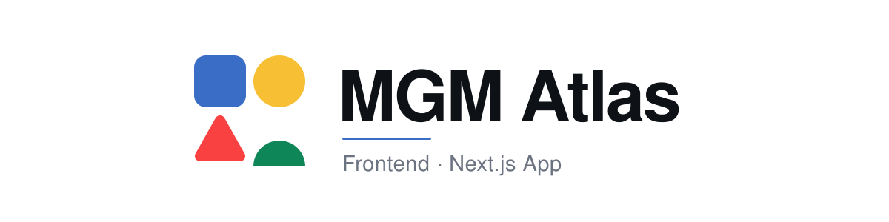
</picture>

<p><em>Your lab's project HQ — portfolio, chat, tasks, and voice in one place, so you don't have to pay for Jira <strong>and</strong> Slack anymore.</em></p>

<p>
  <a href="https://github.com/MGM-Laboratory/mgm-atlas-frontend/actions/workflows/ci.yml"></a>
  <a href="https://github.com/MGM-Laboratory/mgm-atlas-frontend/actions/workflows/production.yml"></a>
  <a href="https://atlas.labmgm.org"></a>
  <a href="LICENSE"></a>
</p>

<p>
  <a href="https://nextjs.org"></a>
  <a href="https://react.dev"></a>
  <a href="https://www.typescriptlang.org"></a>
  <a href="https://tailwindcss.com"></a>
  <a href="https://livekit.io"></a>
</p>

<p>
  <a href="https://atlas.labmgm.org"><strong>Live App</strong></a> ·
  <a href="#-feature-tour">Feature Tour</a> ·
  <a href="#-using-atlas">User Guide</a> ·
  <a href="#-getting-started">Getting Started</a> ·
  <a href="#-design-system">Design System</a> ·
  <a href="https://github.com/MGM-Laboratory/mgm-atlas-backend">Backend API ↗</a>
</p>

</div>

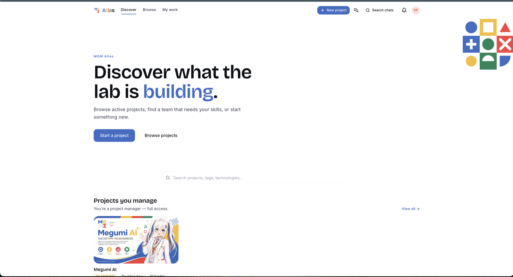

## 🧭 What is MGM Atlas?

MGM Atlas is the **self-hosted project HQ** of [MGM Laboratory](https://mgm.ub.ac.id), a software lab at Universitas Brawijaya. Instead of paying for four tools and losing the team between tabs, the lab runs one app where projects are showcased, discussed, planned, and shipped:

| | Pillar | Feels like |
|---|---|---|
| 📁 | **[Portfolio & Discovery](#-portfolio--discovery)** — every lab project, browsable and beautiful | Netflix |
| 💬 | **[Chat](#-chat)** — workspace + per-project channels, reactions, GIFs, pins | Slack |
| ✅ | **[PMO](#-pmo--tasks-boards-notes-whiteboards)** — lists, kanban, gantt, notes, whiteboards, files | ClickUp |
| 🎙 | **[Voice](#-voice)** — voice/video rooms with screen share and stages | Discord |

> [!NOTE]
> This repository is the **web client**. The API, system architecture diagrams, data model, and endpoint reference live in [**mgm-atlas-backend**](https://github.com/MGM-Laboratory/mgm-atlas-backend#readme).

## ✨ Feature Tour

### 📁 Portfolio & Discovery

Projects are first-class citizens: hero media, tech stacks, phases, team rosters, and a discovery dashboard that surfaces what the lab is building right now.

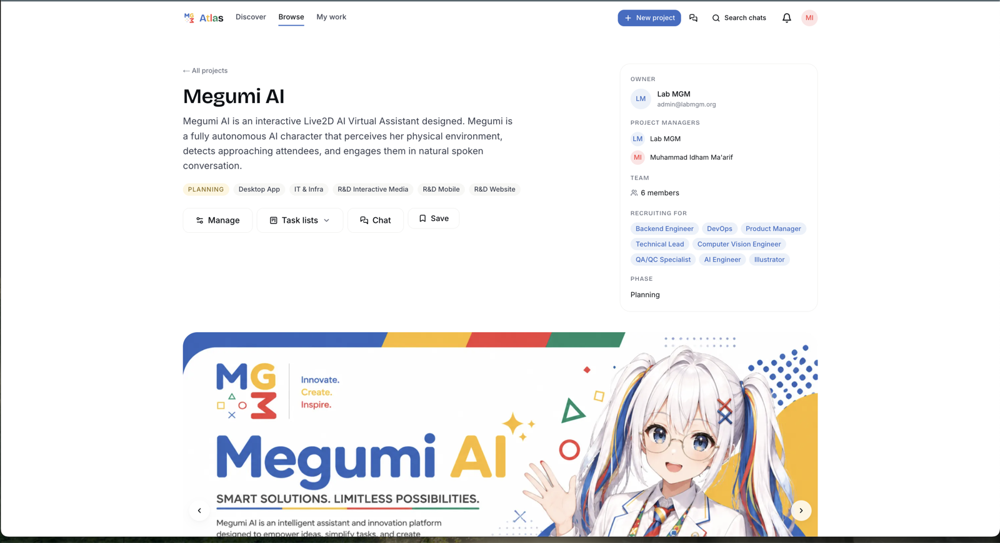

<details>
<summary>More portfolio screenshots</summary>

| | |
|---|---|
|  | 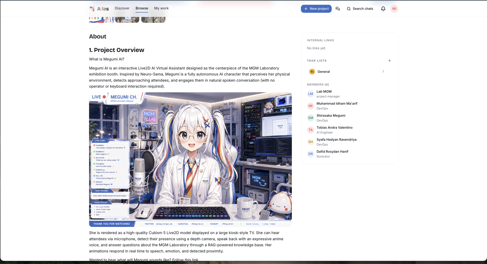 |
| *Browse with filters & status badges* | *Project tabs: overview to whiteboards* |

</details>

### 💬 Chat

A workspace-wide `#general`, a channel per project, and everything you'd expect from a modern messenger: replies, reactions, pins, forwarding, GIFs, stickers, link previews, attachments, and full-text search.


<details>
<summary>More chat screenshots</summary>

| | |
|---|---|
| 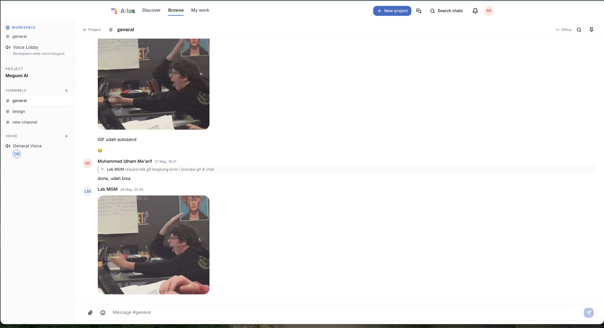 | 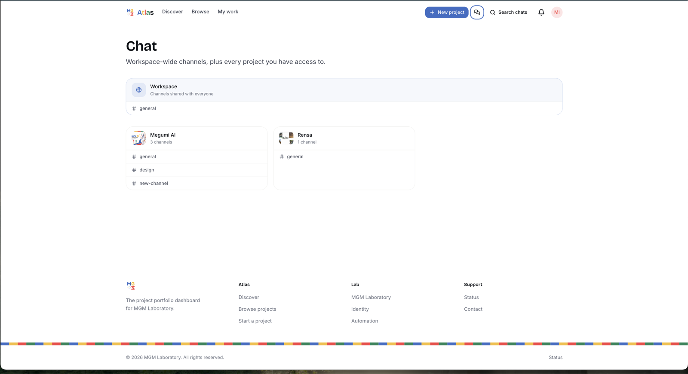 |
| *Project channels with rich media* | *The chat hub — every conversation, one list* |

</details>

### ✅ PMO — tasks, boards, notes, whiteboards

Each project gets task lists with custom statuses, a kanban board, a Gantt timeline, collaborative notes, Excalidraw whiteboards, a file manager, and even embedded external tools — all live-synced between teammates.

| | |
|---|---|
|  |  |
| *Drag-and-drop kanban* | *Gantt timelines* |

<details>
<summary>More PMO screenshots</summary>

| | |
|---|---|
| 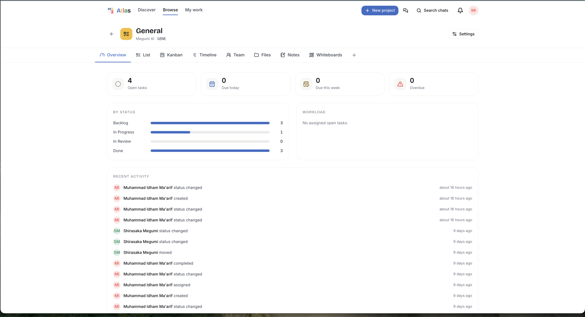 | 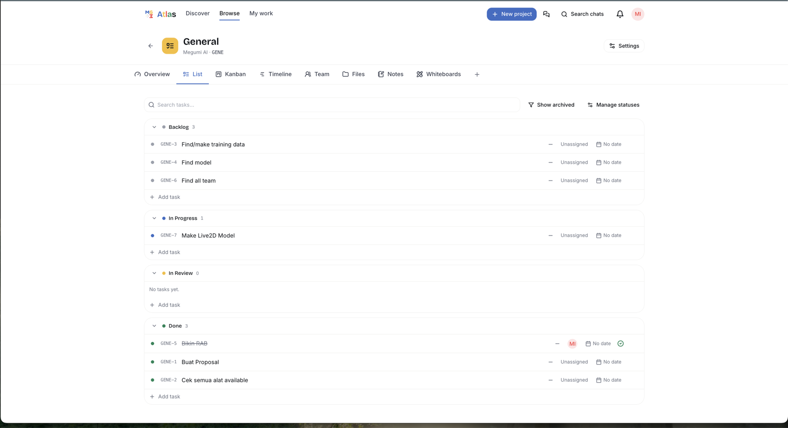 |
| *Overview: counters + activity* | *List view* |
| 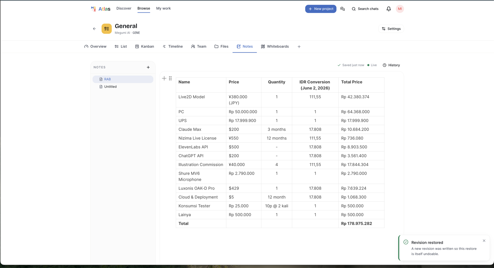 | 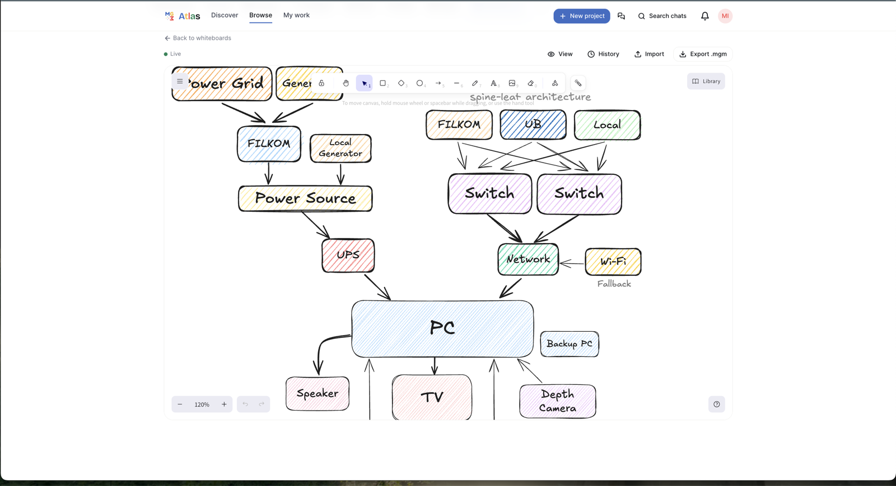 |
| *Notes (BlockNote + Yjs)* | *Whiteboards (Excalidraw + Yjs)* |
| 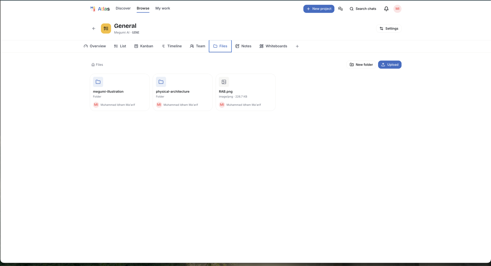 | 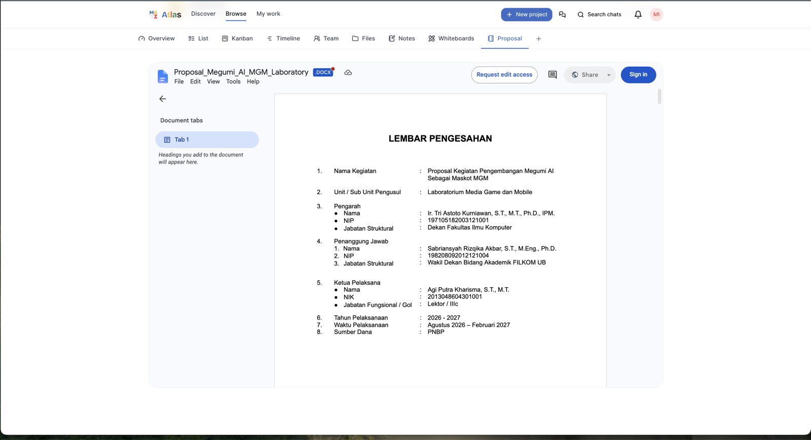 |
| *File manager* | *Embed Figma, Docs, or any site as a tab* |

</details>

### 🎙 Voice

Discord-grade rooms: voice, camera, 1080p60 screen share, per-participant volume, soundboard, moderated stage channels with hand-raise, and recordings — plus a workspace Voice Lobby.


<p align="right">(<a href="#readme-top">back to top</a>)</p>

## 📖 Using Atlas

A tour of the app as a lab member experiences it:

1. **Sign in** — one click takes you to the lab's Keycloak SSO; you come back signed in. No separate Atlas password.

   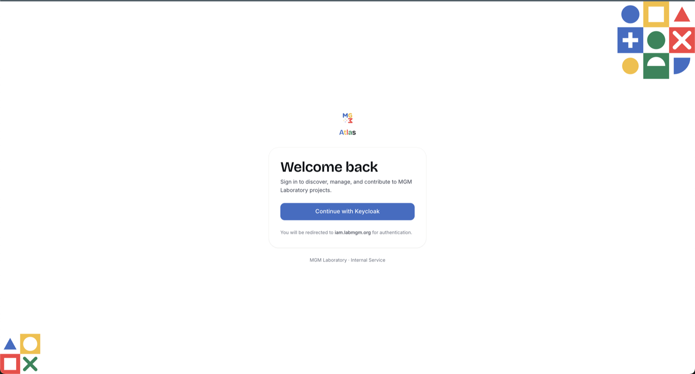

2. **Discover** — the dashboard curates featured and recent projects Netflix-style; **Browse** adds search, tag filters, phases, and recruiting status.

3. **Create a project** — a 5-step wizard: basics → tags & tech stack → media gallery (drag-and-drop, uploads go straight to S3) → team & open roles → review.

   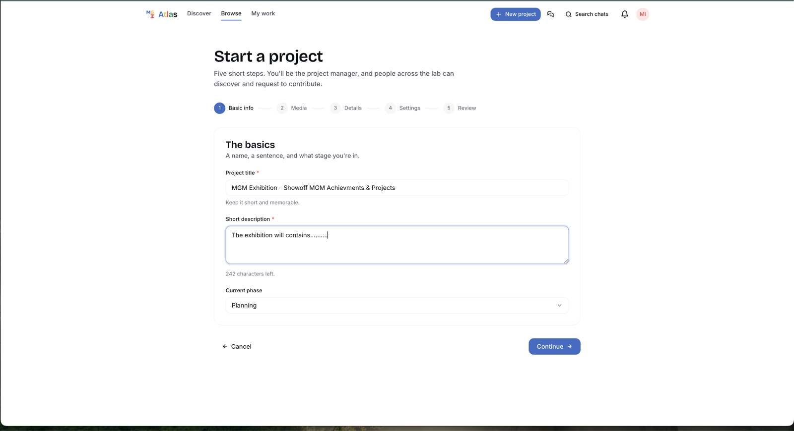

4. **Build the team** — visitors *request to contribute* with a role and message; managers approve or invite people directly. Roles come from a lab-wide catalog (Frontend Engineer, UI/UX Designer, …).

   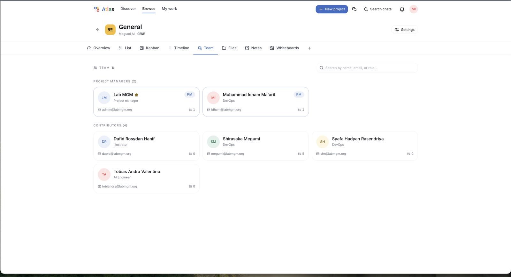

5. **Talk** — every project ships with `#general`; add channels as you grow. Mention with `@`, react, pin decisions, search everything later.

6. **Run the work** — open the project's **Lists** tab and pick your view: List, Kanban, Timeline, Notes, Whiteboards, Files, Team, or a custom embed. <kbd>Cmd</kbd>+<kbd>Z</kbd> undoes almost anything — it's server-backed, so it survives reloads.

   

7. **Hop on voice** — join a project room or the workspace Lobby. Defaults (all rebindable in voice settings):

   | Shortcut | Action |
   |---|---|
   | <kbd>Ctrl</kbd>+<kbd>Shift</kbd>+<kbd>M</kbd> | Toggle mute |
   | <kbd>Ctrl</kbd>+<kbd>Shift</kbd>+<kbd>D</kbd> | Toggle deafen |
   | <kbd>Ctrl</kbd>+<kbd>Shift</kbd>+<kbd>H</kbd> | Disconnect |

   Push-to-talk, device pickers, noise suppression, and chimes live in voice settings and follow you across devices.

8. **Stay in the loop** — **My work** collects what you manage, contribute to, and saved; the bell and `/me/notifications` keep an inbox; browser push (with inline quick-reply) works even with Atlas closed.

   | | |
   |---|---|
   | 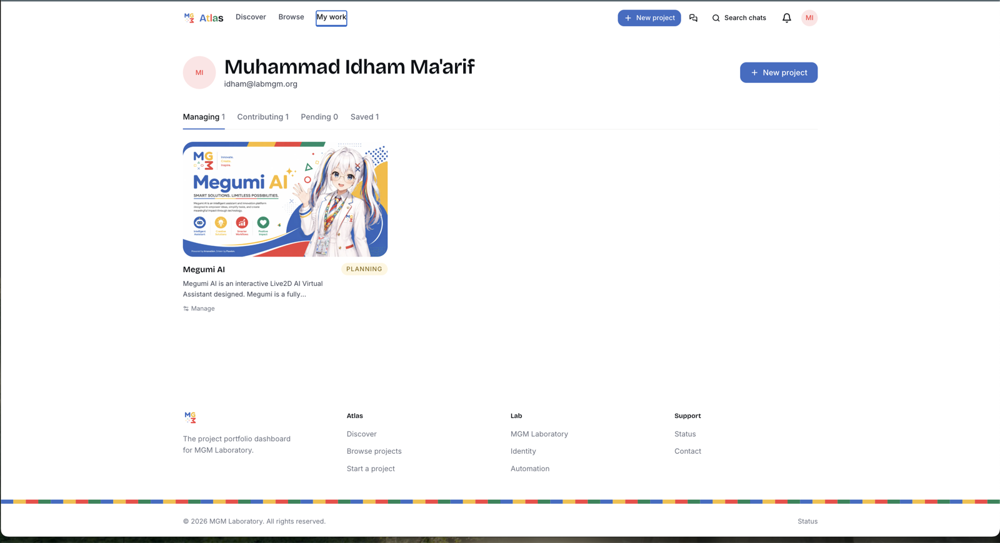 | 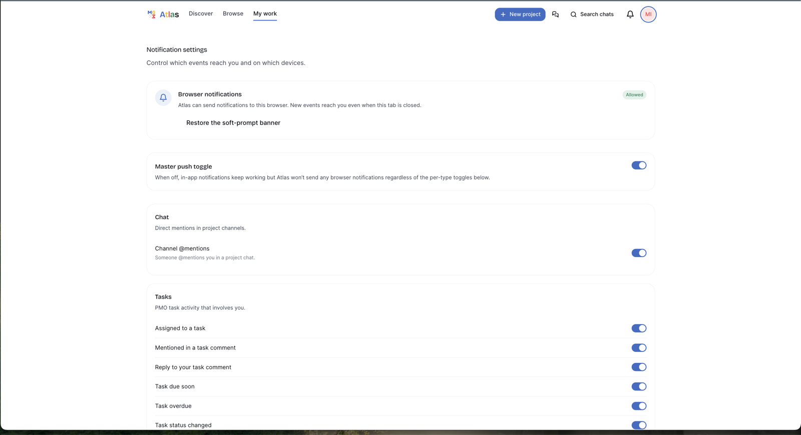 |

Admins additionally get `/admin`: tag manager, featured curation, collaboration roles, user management, and sticker packs.

<p align="right">(<a href="#readme-top">back to top</a>)</p>

## 🛠 Tech stack

| Concern | Choice | Why |
|---|---|---|
| Framework | **Next.js 15** (App Router) + **React 19 RC** | RSC layouts, typed routes, standalone output |
| Language | **TypeScript 5.6** | `experimental.typedRoutes` keeps links honest |
| Styling | **Tailwind CSS 3.4** + design tokens | The entire identity lives in `tailwind.config.ts` |
| UI primitives | **Radix UI** + CVA wrappers in `components/ui/` | Accessible by default, skinned once, reused everywhere |
| Data | **TanStack Query 5** | 30 s staleTime, retries only on 5xx |
| Forms | **React Hook Form + Zod** | Schema-first validation |
| Rich text | **Tiptap** (chat) + **BlockNote** (notes) | Right editor for each job |
| Whiteboards | **Excalidraw** | Live-synced scenes |
| Realtime | **socket.io-client** + **Yjs / y-websocket** | Chat/notifications/voice events + CRDT co-editing |
| Voice | **livekit-client 2.7** | SFU-grade WebRTC with screen share |
| Drag & drop | **dnd-kit** | Kanban + gallery reorder |
| Timeline | **gantt-task-react** | Gantt view |
| Motion | **Framer Motion** + motion tokens | Restrained, reduced-motion aware |
| Icons | **Lucide** (stroke 2.25) | One icon language |

> [!WARNING]
> **Version pinning:** Next 15.0.7 and React 19 RC are pinned together — don't bump one without the other. `next-auth` is still in `package.json` but **unused** (dead weight pending removal); never import from it.

## 🏛 App architecture

Atlas is a thin client over the [backend API](https://github.com/MGM-Laboratory/mgm-atlas-backend): the SPA calls REST under `/api/v1` with a bearer **session ID** (stored in `localStorage` as `atlas_session` after the Keycloak callback — the full sequence diagram lives in the [backend README](https://github.com/MGM-Laboratory/mgm-atlas-backend#-authentication)). Route protection is client-side in `(authenticated)/layout.tsx`; `middleware.ts` is a pass-through. Realtime arrives over three Socket.IO namespaces, Yjs websockets, and LiveKit WebRTC.

### Route map

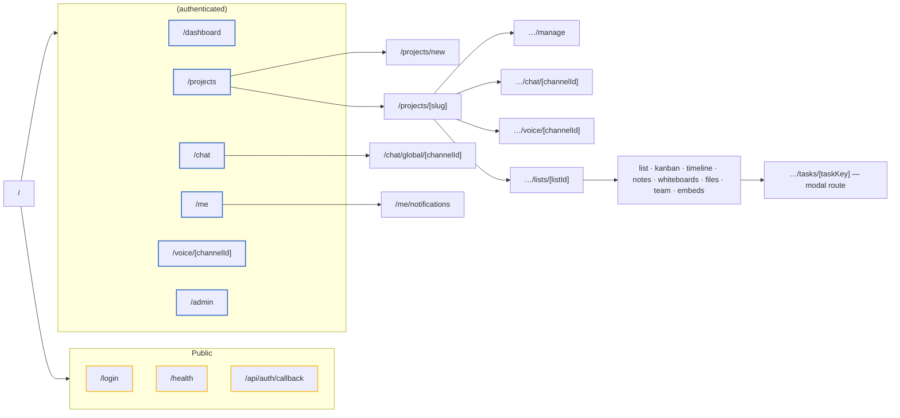
```mermaid
flowchart LR
  ROOT["/"] --> PUB
  ROOT --> AUTH

  subgraph PUB["Public"]
    LOGIN["/login"]
    HEALTH["/health"]
    CB["/api/auth/callback"]
  end

  subgraph AUTH["(authenticated)"]
    DASH["/dashboard"]
    PROJ["/projects"]
    ME["/me"]
    CHAT["/chat"]
    VOICE["/voice/[channelId]"]
    ADMIN["/admin"]
  end

  PROJ --> NEW["/projects/new"]
  PROJ --> SLUG["/projects/[slug]"]
  SLUG --> MANAGE["…/manage"]
  SLUG --> PCHAT["…/chat/[channelId]"]
  SLUG --> PVOICE["…/voice/[channelId]"]
  SLUG --> LISTS["…/lists/[listId]"]
  LISTS --> VIEWS["list · kanban · timeline · notes · whiteboards · files · team · embeds"]
  VIEWS --> TASK["…/tasks/[taskKey] — modal route"]
  CHAT --> GCHAT["/chat/global/[channelId]"]
  ME --> NOTIF["/me/notifications"]

  classDef pub stroke:#f7bf33,stroke-width:2px;
  classDef auth stroke:#3a6dc5,stroke-width:2px;
  class LOGIN,HEALTH,CB pub;
  class DASH,PROJ,ME,CHAT,VOICE,ADMIN auth;
```

### Voice connection lifecycle

Simplified from the ~1,500-line voice provider (`src/lib/voice/voice-provider.tsx`):

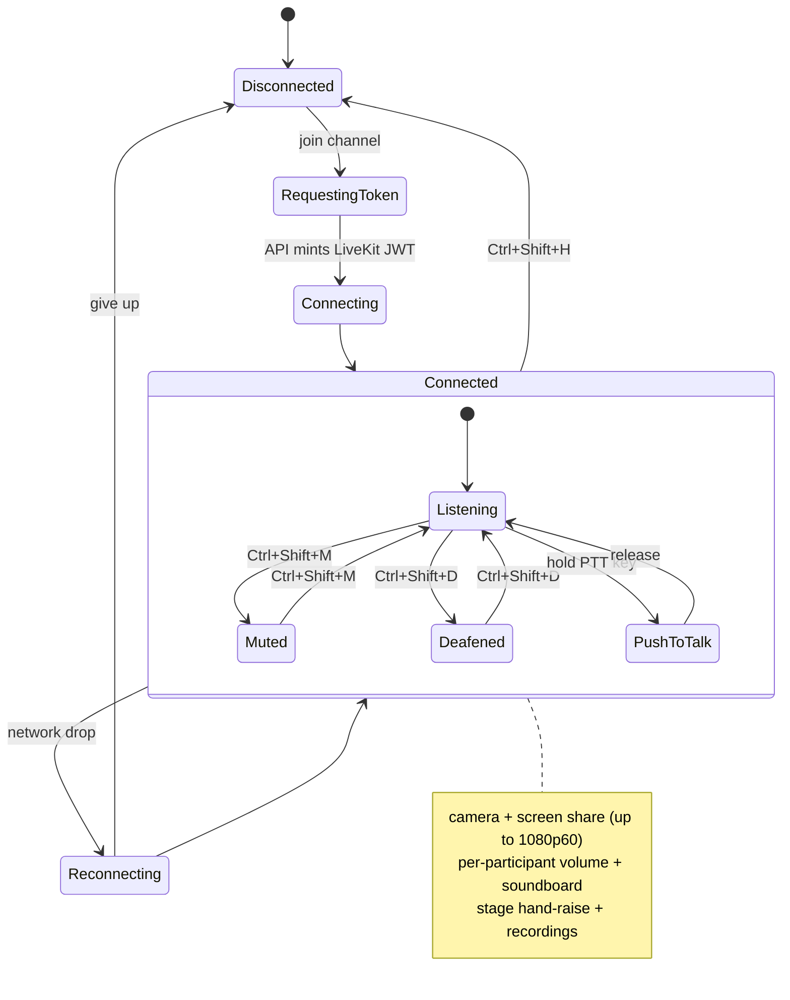
```mermaid
stateDiagram-v2
  [*] --> Disconnected
  Disconnected --> RequestingToken : join channel
  RequestingToken --> Connecting : API mints LiveKit JWT
  Connecting --> Connected
  Connected --> Reconnecting : network drop
  Reconnecting --> Connected
  Reconnecting --> Disconnected : give up
  Connected --> Disconnected : Ctrl+Shift+H

  state Connected {
    [*] --> Listening
    Listening --> Muted : Ctrl+Shift+M
    Muted --> Listening : Ctrl+Shift+M
    Listening --> Deafened : Ctrl+Shift+D
    Deafened --> Listening : Ctrl+Shift+D
    Listening --> PushToTalk : hold PTT key
    PushToTalk --> Listening : release
  }

  note right of Connected
    camera + screen share (up to 1080p60)
    per-participant volume + soundboard
    stage hand-raise + recordings
  end note
```

### PMO at a glance

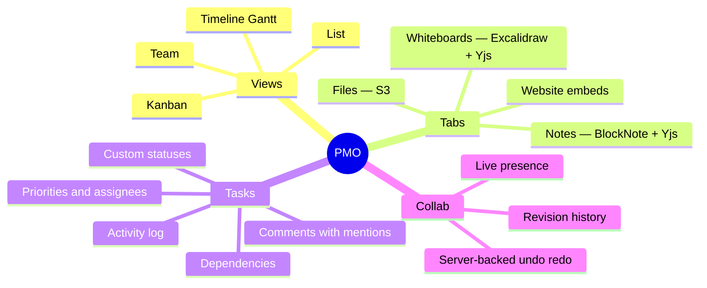
```mermaid
mindmap
  root((PMO))
    Views
      List
      Kanban
      Timeline Gantt
      Team
    Tabs
      Notes — BlockNote + Yjs
      Whiteboards — Excalidraw + Yjs
      Files — S3
      Website embeds
    Tasks
      Custom statuses
      Priorities and assignees
      Dependencies
      Comments with mentions
      Activity log
    Collab
      Live presence
      Server-backed undo redo
      Revision history
```

System-level diagrams — full architecture, auth sequence, ERD, realtime topology, S3 presign flow — live in the [backend README](https://github.com/MGM-Laboratory/mgm-atlas-backend#-architecture).

<p align="right">(<a href="#readme-top">back to top</a>)</p>

## 🚀 Getting started

**Prerequisites:** Node ≥ 20.11, pnpm, and the [backend](https://github.com/MGM-Laboratory/mgm-atlas-backend) running on `:3000`.

```bash
pnpm install
cp .env.example .env       # set NEXT_PUBLIC_API_URL=http://localhost:3000/api/v1
pnpm dev                   # → http://localhost:3001
```

> [!NOTE]
> **Feature flags mirror the backend.** PMO and voice UIs are hidden unless `NEXT_PUBLIC_PMO_ENABLED` / `NEXT_PUBLIC_VOICE_ENABLED` are `true` *and* the backend has the matching flags on. Keep both sides in sync per environment.

<details>
<summary><strong>Environment variables</strong> (from <code>.env.example</code>)</summary>

| Variable | Required | Purpose |
|---|---|---|
| `NEXT_PUBLIC_APP_URL` | ✅ | Public app origin (OAuth redirects) |
| `NEXT_PUBLIC_API_URL` | ✅ | Backend base, e.g. `http://localhost:3000/api/v1` |
| `NEXT_PUBLIC_KEYCLOAK_ISSUER` | ✅ | Keycloak realm issuer URL |
| `NEXT_PUBLIC_KEYCLOAK_CLIENT_ID` | ✅ | Public OAuth client ID |
| `KEYCLOAK_CLIENT_SECRET` | ✅ | Server-side code exchange in the callback route |
| `NEXT_PUBLIC_SOCKET_URL` | — | Socket origin; derived from API URL when empty |
| `NEXT_PUBLIC_PMO_ENABLED` | — | Show PMO UI (`false` by default) |
| `NEXT_PUBLIC_VOICE_ENABLED` | — | Show voice UI (`false` by default) |
| `NEXT_PUBLIC_YJS_WS_URL` | — | Yjs co-editing endpoint (empty = single editor) |
| `NEXT_PUBLIC_LIVEKIT_URL` | — | LiveKit signaling URL (voice) |
| `PORT` / `HOST_PORT` | — | Serve port (default 3001) |

**`NEXT_PUBLIC_*` values are baked into the build** (Docker build args) — changing them requires a rebuild, not a restart.

</details>

## 🗂 Project structure

```
src/
├── app/
│   ├── layout.tsx               # fonts, providers, metadata
│   ├── (authenticated)/         # session-gated routes (layout enforces)
│   │   ├── dashboard/ projects/ chat/ voice/ me/ admin/
│   │   └── projects/[slug]/lists/[listId]/   # PMO views + task modal
│   ├── login/ health/
│   └── api/auth/callback/       # Keycloak code → backend session
├── components/
│   ├── ui/                      # Radix + CVA primitives (button, dialog, …)
│   ├── brand/                   # Wordmark, geometric patterns
│   ├── chat/ pmo/ voice/        # feature components
│   └── media/ rich-text/ admin/ …
└── lib/
    ├── api/                     # client.ts · server.ts · paths.ts (route SoT) · queries.ts
    ├── realtime/                # socket.io singletons (/chat /voice /notifications)
    ├── voice/                   # LiveKit provider state machine
    ├── yjs/                     # y-websocket provider
    └── hooks/ types.ts
```

`src/lib/api/paths.ts` is the **single source of truth** for backend routes — add endpoints there, never inline path strings.

## 📜 Scripts

| Script | What it does |
|---|---|
| `pnpm dev` | Dev server on `:3001` |
| `pnpm build` | Production build (standalone output) |
| `pnpm start` | Serve the built app |
| `pnpm typecheck` | `tsc --noEmit` — CI gates on this |
| `pnpm lint` | `next lint` — CI gates on this too |
| `pnpm format` | Prettier over `src/**` |

There is no test suite yet — CI is typecheck + lint.

## 🎨 Design system

The MGM identity is locked into design tokens — the full ruleset lives in [`docs/design-system.md`](docs/design-system.md). The five laws:

1. **Tokens, not literals** — colors, type ramp, radii, shadows, durations, easings all come from `tailwind.config.ts`.
2. **One leading brand color per surface** — blue `#3a6dc5`, yellow `#f7bf33`, red `#f94141`, or green `#0f8657`; all four only meet inside the geometric pattern components.
3. **Stroke icons only** — Lucide at `strokeWidth={2.25}`.
4. **Restrained motion** — token durations/easings, `prefers-reduced-motion` respected.
5. **Pattern as accent, never wallpaper** — `<PatternCorner>` / `<PatternDado>` only.

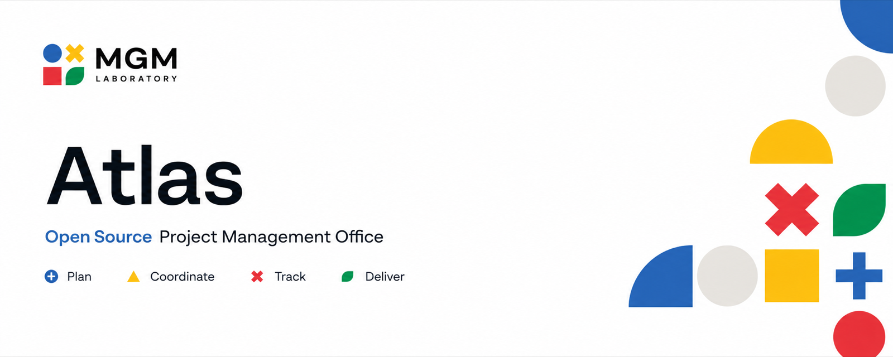

## 📲 PWA & push

Atlas ships a web manifest and a service worker: install it like an app, and (once the backend has VAPID keys) receive browser push notifications with **inline quick-reply** — answer a chat mention straight from the notification, app closed.

## 🚢 Deployment

Multi-stage Alpine `Dockerfile` building Next's standalone output (`tini` as PID 1, healthcheck on `/health`). GitHub Actions builds images: PRs → `staging*` tags, pushes to `main` → `latest*` tags, with `NEXT_PUBLIC_*` baked via build args. Docs-only changes skip image builds.

## 🤝 Contributing, security & support

- **[CONTRIBUTING](.github/CONTRIBUTING.md)** — setup, branch model, commit style, design-token rules
- **[SECURITY](.github/SECURITY.md)** — private vulnerability reporting, please
- **[SUPPORT](.github/SUPPORT.md)** — bugs → issues, questions → [Discussions](https://github.com/MGM-Laboratory/mgm-atlas-frontend/discussions)

> [!IMPORTANT]
> **Proprietary, source-visible.** This code is published to read and learn from, but it is **not open source**: use, deployment, and code contribution are restricted under the [Estella Solusi Digital Proprietary License v1.0](LICENSE) (ESDPL). Code contributions are limited to active MGM Laboratory members — see [CONTRIBUTING](.github/CONTRIBUTING.md).

Standing on excellent shoulders: [Next.js](https://nextjs.org), [Radix UI](https://www.radix-ui.com), [shadcn/ui](https://ui.shadcn.com) patterns, [LiveKit](https://livekit.io), [Yjs](https://yjs.dev), [Excalidraw](https://excalidraw.com), [BlockNote](https://www.blocknotejs.org), [Tiptap](https://tiptap.dev). 💛

---

<div align="center">
  <sub>
    MGM Atlas · <a href="https://atlas.labmgm.org">atlas.labmgm.org</a> · <a href="mailto:atlas@labmgm.org">atlas@labmgm.org</a><br>
    © 2026 Estella Solusi Digital · Built with care by <a href="https://mgm.ub.ac.id">MGM Laboratory</a>, Universitas Brawijaya
  </sub>
</div>
